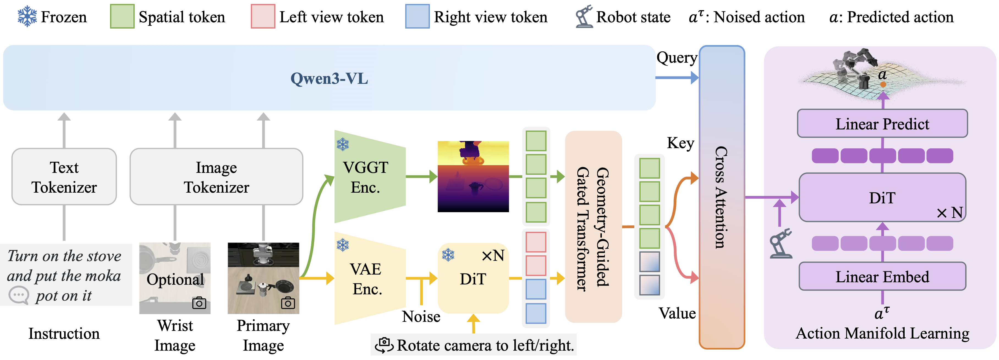

<div align="center">

<h1>Learning Action Manifold with Multi-view Latent Priors for Robotic Manipulation</h1>


<p align="center">
  <a href="https://arxiv.org/abs/2605.11832"></a>
  <a href="https://junjxiao.github.io/Multi-view-VLA.github.io/"></a>
    <a href="https://www.huggingface.co/datasets/junjin0/libero_mv_feats"></a>
    <a href="https://huggingface.co/junjin0/Multi-view-VLA"></a>
    <a href="https://www.modelscope.cn/models/junjxiao/Multi-view-VLA"></a>
    <a href="https://www.modelscope.cn/datasets/junjxiao/libero_mv_feats"></a>
</p>

</div>


## 🌟 Multi-view-VLA addresses the challenges of spatial perception and manipulation in Vision-Language-Action (VLA)
<div style="text-align: center;">
  
</div>

- **Novel Framework:** We present a VLA framework that enables reliable spatial perception and efficient action learning, allowing for robust and precise robotic manipulation.

- **Geometry-Guided Gated Transformer:** We introduce Geometry-Guided Gated Transformer to address the inherent monocular depth ambiguity by leveraging multi-view diffusion priors to provide geometry guidance.

- **Action Manifold Learning:** We propose Action Manifold Learning, a direct action prediction mechanism to avoid the limitations of traditional diffusion-based indirect noise/velocity decoding, achieving more efficient action learning.

---

## 📢 News
[2026-5-8] 🥳🥳**Our**'s 🎉🎉 [training and inference code](https://github.com/junjxiao/Multi-view-VLA), [pre-trained weight](https://www.modelscope.cn/models/junjxiao/Multi-view-VLA) and [data](https://www.modelscope.cn/datasets/junjxiao/libero_mv_feats) are now available.🎉🎉

---


## Table of Contents
- [🛠️ Installation](#-Installation)
- [🏆 Model Zoo](#-Model-Zoo)
- [📈 Training and Evaluation](#-Training-and-Evaluation)
- [📜 Citing](#-Citing)
- [🙏 Acknowledgement](#-acknowledgement)

## 🛠️ Installation

Create the required environment through the following steps:


```bash
# Clone the repo
git clone https://github.com/junjxiao/Multi-view-VLA.git
cd Multi-view-VLA
cd third_party
git clone https://github.com/facebookresearch/vggt.git
cd ..

# Create conda environment
conda create -n multiview_vla python=3.10 -y
conda activate multiview_vla

# Install requirements
pip install -r requirements.txt

# Install FlashAttention2
pip install flash-attn --no-build-isolation

# Install
pip install -e .

```


## 🏆 Model Zoo

| Model Name | Huggingface Repository  |Description |
| :--- |  :--- | :--- |
| Modelscope &nbsp; | [🤖 Pretrained models](https://www.modelscope.cn/models/junjxiao/Multi-view-VLA)  | Pretrained base model, Pretrained LIBERO model and Lora model of LongCat-Image-Edit model. |
| Huggingface &nbsp; | [🤗 Pretrained models](https://huggingface.co/junjin0/Multi-view-VLA)  | Pretrained base model, Pretrained LIBERO model and Lora model of LongCat-Image-Edit model. |

---
Download our pretrained models to `./checkpoints`.

Please also download [Qwen3-VL](https://huggingface.co/StarVLA/Qwen3-VL-4B-Instruct-Action), [VGGT](https://huggingface.co/facebook/VGGT-1B) and [LongCat-Image-Edit](https://huggingface.co/meituan-longcat/LongCat-Image-Edit) to `./checkpoints`.

## 📈 Training and Evaluation
Please refer to the guidance in the `examples` folder to train and evaluate the benchmarks.

### Results 🎉🎉
|  | LIBERO | LIBERO-PLUS | RoboTwin2.0 |
| :--- | :--- | :--- | :--- |
| **Ours** | **98.6** | **85.7** | **86.1**|

---

## 📜 Citing

If you find **our model** is useful in your research or applications, please consider giving us a **star** 🌟 and **citing** it by the following BibTeX entry:

```
@article{xiao2026learning,
    title={Learning Action Manifold with Multi-view Latent Priors for Robotic Manipulation}, 
    author={Junjin Xiao and Dongyang Li and Yandan Yang and Shuang Zeng and Tong Lin and Xinyuan Chang and Feng Xiong and Mu Xu and Xing Wei and Zhiheng Ma and Qing Zhang and Wei-Shi Zheng},
    year={2026},
    journal={arxiv:2605.11832},
}
            
```

---


## 🙏 Acknowledgement
This project builds upon [starVLA](https://github.com/starVLA/starVLA), [Qwen3-VL](https://github.com/QwenLM/Qwen3-VL), [vggt](https://github.com/facebookresearch/vggt), [JiT](https://github.com/LTH14/JiT), [LeRobot](https://github.com/huggingface/lerobot), [Isaac-GR00T](https://github.com/NVIDIA/Isaac-GR00T) and [any4lerobot](https://github.com/Tavish9/any4lerobot). We thank these teams for their open-source contributions.

