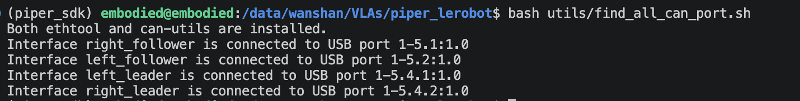
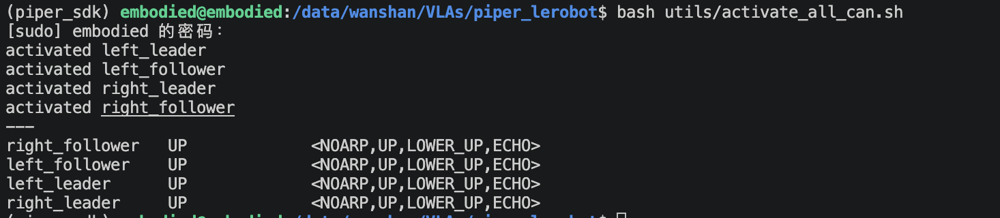

**English** | [中文](README.zh.md)

# Deploy — run policies on Piper arms

A small client-server deployment layer:

- **Server** (`deploy/server.py`): loads one policy adapter, in whatever
  environment that policy needs.
- **Client** (`deploy/client.py`): runs on the machine wired to the Piper
  arms and cameras, streams observations to the server, executes the
  returned action chunks.

To serve a model, implement an adapter using `deploy/adapters/base.py` or the
example in `deploy/adapters/dummy.py`. The client, transport, and chunk
execution stay shared.

## Quick Start

Run from the repository root in two terminals:

On the 4090 workstation, `piper_sdk` already contains Piper SDK, the
Piper-enabled lerobot, and all client dependencies. Nothing needs to be
installed; just activate the environment.

```bash
# terminal 1, on the model/GPU machine
conda activate <model-env>
python -m deploy.server --config <model-config>

# terminal 2: robot client
conda activate piper_sdk
python -m deploy.client --config <model-config> --task="your task" --duration_s=60
```

Hardware smoke test that only moves the bimanual arms toward home:

```bash
python -m deploy.server --config home
python -m deploy.client --config home --task=home --duration_s=5
```

## Configs

A config (`deploy/configs/<name>.json`) records adapter arguments, port, robot,
cameras, and `camera_map`. Activate each model's environment before launch;
the config does not manage environments. Extra CLI flags override config values.

- `example` — dummy server only, no robot
- `home` — dummy policy that drives the arms toward home
- `pi05` — real checkpoint; machine-specific setup in its `_notes`

- `server.adapter` and `server.args` — checkpoint, device, RTC, compilation,
  and model-specific options;
- `server.port` — the endpoint used by the matching client config.

### Remote server

The policy server can run on a remote GPU machine, with the client on the
box wired to the arms. Clone this repo on both machines and set in the config:

```json
"server": { "host": "0.0.0.0", ... }
"client": { "server": "http://<gpu-box-ip>:<port>", ... }
```

Run the server on the GPU machine and the client on the robot machine with the
same config. `--server=http://<ip>:<port>` overrides the client URL. The server
has no authentication; expose it only on a trusted network.

## Add a Policy

The easiest integration is a `PolicyAdapter`; the shared HTTP server handles
transport. Adapter constructor arguments from `server.args` arrive as strings.

```python
import numpy as np
from deploy.adapters.base import PolicyAdapter

class MyPolicyAdapter(PolicyAdapter):
    def info(self):
        return {
            "name": "my-policy",
            "image_keys": ["top", "left_wrist", "right_wrist"],
            "state_dim": 14,
            "action_dim": 14,
            "chunk_size": 30,
            "fps": 30,
            "checkpoint": "...",
        }

    def predict_chunk(self, images, state, task, consumed=-1, delay_ticks=0):
        # preprocess images/state/task, run the model, then return:
        return np.asarray(actions, dtype=np.float32)  # shape (30, 14)

    def reset(self):
        pass
```

Then:

1. Put the adapter in an importable module in the model environment.
2. Copy `deploy/configs/example.json` to a new config and set `server.adapter`
   to a dotted class path like
   `my_policy.deploy:MyPolicyAdapter`.
3. Add a `client` section for the robot, cameras, and `camera_map`.
4. Run server and client as in Quick Start.

## Robot Setup

All four Piper CAN interfaces (`left_leader`, `left_follower`,
`right_leader`, `right_follower`) must be found and activated before a run.

```bash
# Find the arms
bash utils/find_all_can_port.sh
```



```bash
# Activate the arms
bash utils/activate_all_can.sh
```



```bash
# Softly disable after a run
python utils/disable_arms.py                           # all 4 arms
python utils/disable_arms.py left_follower --no-home   # one arm, release in place
```

## Wire Protocol

### Client input and model output

`predict_chunk(images, state, task, consumed, delay_ticks)` receives:

- `images`: `{policy_image_key: image}`. Every image is an HWC `uint8` RGB
  array. `client.camera_map` maps robot camera names to these policy keys; for
  example `{"top": "camera1"}` sends the robot's `top` camera as `camera1`.
- `state`: a float32 vector with shape `(state_dim,)`. Values are the robot's
  motor observations in exactly `robot.action_features` order. The adapter is
  responsible for applying the same units and normalization used in training.
- `task`: the CLI `--task` string, unchanged.
- `consumed`: number of rows already consumed from the previous action chunk,
  or `-1` on the first request.
- `delay_ticks`: predicted inference latency measured in control ticks.
  Non-RTC policies may ignore both RTC fields.

The adapter must return finite float32 absolute motor targets with shape
`(chunk_size, action_dim)`. Columns must use the same order and units as
`robot.action_features`; rows are executed sequentially at `fps`. These are
absolute targets, not deltas.

### HTTP API

Model authors who use the shared `deploy.server` only implement the adapter
above. A standalone compatible server must implement:

- `GET /info` → JSON containing `protocol_version`, `name`, `image_keys`,
  `state_dim`, `action_dim`, `chunk_size`, `fps`, and `checkpoint`.
- `POST /predict` → compressed NumPy `.npz`: `img_<key>` arrays, `state`,
  `task`, and optional `consumed`/`delay_ticks`. Return a raw NumPy `.npy`
  float32 action chunk.
- `POST /reset` → clear episode state and return HTTP 200.

Use `deploy.protocol.decode_observation()` and `encode_chunk()` to avoid
reimplementing the binary format. NumPy loading always uses
`allow_pickle=False`.
